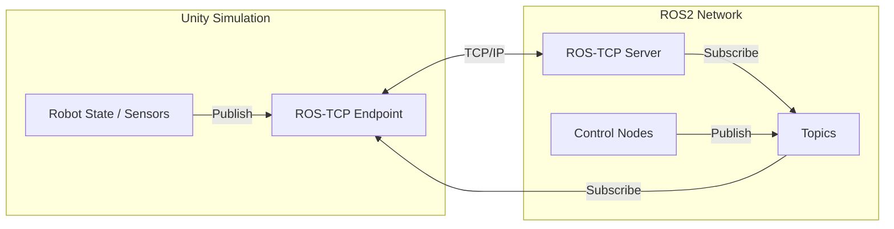
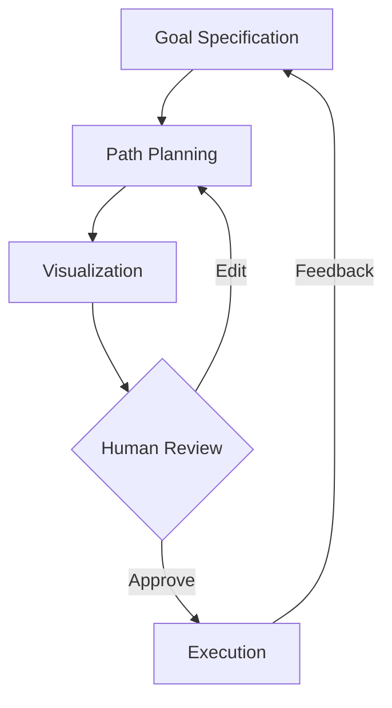
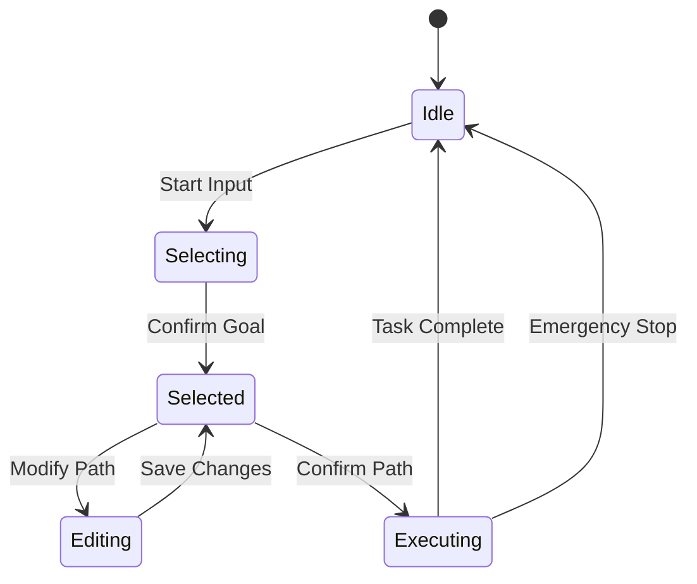

# Shared Autonomy in VR: Operator and Robot Collaborative Control with Visual Feedback
*Master’s Degree in Robotics Engineering, University of Genoa - Virtual Reality for Robotics*

## Overview
Shared autonomy is a human-robot interaction paradigm where control is distributed between a human operator and an autonomous system, combining human judgment with robot planning capabilities. This project implements a shared autonomy pipeline for mobile robot navigation in VR: a ROS2-based planner Nav2 generates multiple candidate trajectories that are visualized in real time inside a Unity simulation, where the operator can select or edit them via a VR/GUI interface before sending the final path to the robot for execution. The goal is to provide a modular and extensible platform for future research in human-robot collaboration.


https://github.com/user-attachments/assets/5eca5cfb-2170-4491-b4e2-cf1b84357ff8
---
## Requirements

- **ROS2 Jazzy** — middleware for robot communication and path planning
- **Ubuntu 24.04** — required host OS for ROS2
- **Unity 2022.3.62f3** — simulation environment and VR interface
- **ALVR** — wireless PC VR streaming to standalone headset

### Requirements / Dependencies
Required in Unity:
- **URDF importer** <https://github.com/Unity-Technologies/URDF-Importer.git?path=/com.unity.robotics.urdf-importer#v0.5.2>
- **ROS TCP ENDPOINT** <https://github.com/Unity-Technologies/ROS-TCP-Connector.git?path=/com.unity.robotics.ros-tcp-connector>
- **ROS2 navigation** <https://github.com/CarmineD8/ros2_navigation>
- **XR plugin**

Required for ROS2:

- **slam toolbox** 
```bash
sudo apt-get install ros-jazzy-slam-toolbox
```
- **nav2** 
```bash
sudo apt-get install ros-jazzy-nav2
```

and be sure to install:

- **nav2-bringup** 
```bash
sudo apt install ros-jazzy-nav2-bringup
```
- **nav2-amcl** 
```bash
sudo apt install ros-jazzy-nav2-amcl
```
---
## System Architecture

The system relies on a bidirectional communication flow between the **Unity Simulation** and the **ROS2 Network**, bridged by the **ROS-TCP-Endpoint**.



## Shared Autonomy Pipeline

The system implements a human-in-the-loop workflow, allowing operators to supervise and modify robot trajectories via VR before execution.



## UI States

The VR interface operates as a finite state machine (FSM) to manage user interactions and robot commands safely.


---

## Simulation

### Unity
- **Version**: 2022.3.62f3 (LTS)
- **Role**: Physics engine and VR rendering environment
- **Integration**: ROS-TCP-Connector for bidirectional communication

### Environment
- **Type**: 3D simulated workspace with collision meshes
- **Features**: 
  - Dynamic obstacle spawning
  - Configurable lighting and textures
  - Ground truth sensor simulation (LiDAR, RGB-D, IMU)

### Robot Type
- **Model**: Mogi Bot ([see documentation](./docs/mogi-bot.md))
- **Characteristics**:
  - Differential drive base
  - Modular sensor payload
  - URDF/SDF description available for Gazebo/Unity sync

---
## Launch File


# Nodes Description


---
# Configuration and Additional Files

This document describes the main configuration files and resources used by the package.

---

## Configuration Files (`config/`)

### `amcl_localization.yaml`
- Parameters for AMCL localization
- Particle filter configuration
- Sensor and motion model tuning

### `navigation.yaml`
- Configuration for the Navigation2 stack
- Planner, controller, and recovery behaviors

---

## Launch Files (`launch/`)

### `assignment.launch.py`
- Main launch file
- Starts the full system (simulation, planning, perception, navigation)

### `localization.launch.py`
- Starts AMCL localization
- Loads the map and localization parameters

### `navigation.launch.py`
- Launches the Navigation2 stack

### `spawn_robot_aruco.launch.py`
- Spawns the robot in Gazebo
- Allows selection of the robot model via `model_arg`

---

## Maps (`maps/`)

- `map_of_world.yaml`  
- `map_of_world.pgm`  

Used for localization and navigation. The map was generated by manually navigating the robot in the environment and finally save the map by executing:
``` bash
ros2 run nav2_map_server map_saver_cli -f map_of_world 
```
---


---
### Simulation

## Installation
- Clone the package inside your ROS2 workspace src folder:
```bash
cd ~/ros2_ws/src/
git clone https://github.com/paololais/ERL_assignment2.git
```

- Build the package and source:
```bash
cd ~/ros2_ws
colcon build
source install/local_setup.bash
```

## Usage
- Launch the Gazebo simulation, Rviz, calculate the plan and execute it:
```bash
ros2 launch assignment2 assignment.launch.py
```


